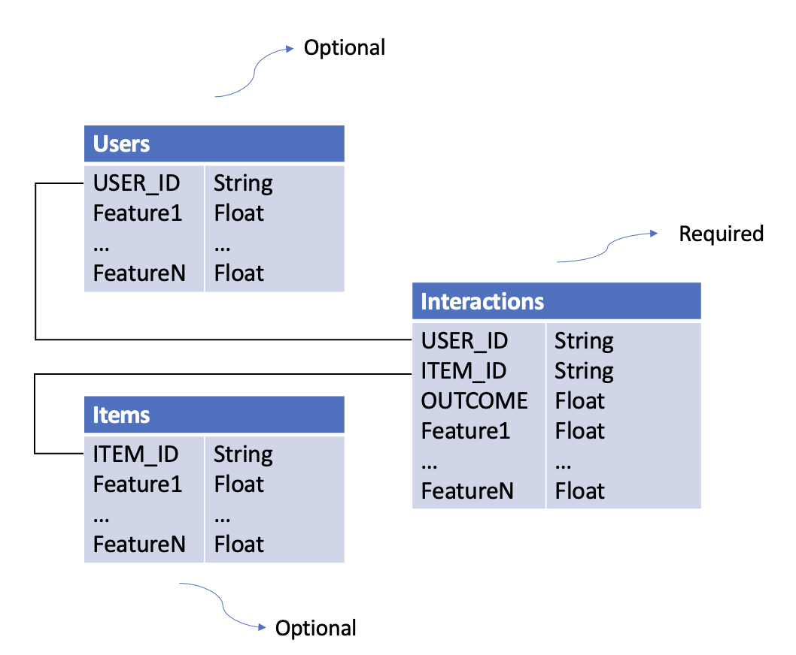

# Dataset Preparation

Understanding how to prepare datasets is crucial for building effective recommendation systems with this library. This guide covers the required dataset structure, schemas, and preprocessing options.

## Dataset Types

There are **three types of datasets** required for training recommendation models:

### 1. Interactions Dataset

**Purpose**: Captures what happened when users interacted with items.

**Required Columns**:
- `USER_ID` (str): Unique identifier for the user
- `ITEM_ID` (str): Unique identifier for the item
- `OUTCOME` (float): The reward/outcome of the interaction (e.g., click=1/0, revenue=$$$)

**Optional Columns**: Any context features (e.g., timestamp, device, location)

**Example**:
```python
interactions_df = pd.DataFrame({
    "USER_ID": ["user_1", "user_1", "user_2"],
    "ITEM_ID": ["item_A", "item_B", "item_A"],
    "OUTCOME": [1.0, 0.0, 1.0],
    "timestamp": [1234567890, 1234567900, 1234567910],
    "device": ["mobile", "desktop", "mobile"]
})
```

### 2. Users Dataset

**Purpose**: Contains user-level features.

**Required Columns**:
- `USER_ID` (str): Must match IDs in Interactions dataset

**Optional Columns**: Any user features (e.g., age, location, preferences)

**Example**:
```python
users_df = pd.DataFrame({
    "USER_ID": ["user_1", "user_2", "user_3"],
    "age": [25, 35, 45],
    "location": ["CA", "TX", "NY"],
    "income": [50000, 75000, 100000]
})
```

### 3. Items Dataset

**Purpose**: Contains item-level features.

**Required Columns**:
- `ITEM_ID` (str): Must match IDs in Interactions dataset

**Optional Columns**: Any item features (e.g., category, price, brand)

**Example**:
```python
items_df = pd.DataFrame({
    "ITEM_ID": ["item_A", "item_B", "item_C"],
    "category": ["electronics", "clothing", "electronics"],
    "price": [299.99, 49.99, 199.99],
    "brand": ["Apple", "Nike", "Samsung"]
})
```

## Dataset Relationships



**Key Points**:
- Bold columns are required
- Additional columns become features automatically
- Datasets are joined on `USER_ID` and `ITEM_ID`

## Schemas

Schemas define data types, validation rules, and preprocessing options for your datasets.

### Why Use Schemas?

1. **Type Safety**: Specify data types for each column
2. **Validation**: Automatically validate training and inference data
3. **Feature Selection**: Easily experiment with different feature subsets
4. **Preprocessing**: Configure categorical encoding strategies

### Schema File Format

Schemas are defined in YAML files:

```yaml
columns:
  - name: USER_ID
    type: str
  - name: ITEM_ID
    type: str
  - name: OUTCOME
    type: float
  - name: age
    type: int
  - name: state
    type: str
    vocab: ["CA", "TX", "NC", "NY"]  # Vocabulary-based encoding
  - name: zip_code
    type: str
    hash_buckets: 100  # Hash bucketing
```

!!! warning "Case Sensitivity"
    Schema definitions are **case-sensitive**. `USER_ID` ≠ `user_id`

### Required Schemas

The library provides required schemas for validation:

- [interactions_schema_training.yaml](https://github.com/intuit/scikit-rec/blob/main/skrec/dataset/required_schemas/interactions_schema_training.yaml)
- [interactions_schema_inference.yaml](https://github.com/intuit/scikit-rec/blob/main/skrec/dataset/required_schemas/interactions_schema_inference.yaml)
- [users_schema.yaml](https://github.com/intuit/scikit-rec/blob/main/skrec/dataset/required_schemas/users_schema.yaml)
- [items_schema.yaml](https://github.com/intuit/scikit-rec/blob/main/skrec/dataset/required_schemas/items_schema.yaml)

## Categorical Preprocessing

The library supports two methods for handling categorical features:

### 1. Vocabulary-Based Encoding (One-Hot)

**Use when**: You have a predefined, small set of categories.

**How it works**: Creates binary columns for each category value.

**Configuration**:
```yaml
- name: state
  type: str
  vocab: ["CA", "TX", "NC"]
```

**Result**: Creates columns `state_0`, `state_1`, `state_2`, `state_unknown`

**Handling Unknown Values**:
- Out-of-vocabulary values → `state_unknown = 1`
- NaN values → `state_unknown = 1`

**Example**:
```python
# Input
state = "CA"
# Output after encoding
state_0=1, state_1=0, state_2=0, state_unknown=0

# Input
state = "FL"  # Not in vocab
# Output after encoding
state_0=0, state_1=0, state_2=0, state_unknown=1
```

### 2. Hash Bucketing

**Use when**: You have many categories or an unknown number of categories.

**How it works**: Hashes each value into a fixed number of buckets.

**Configuration**:
```yaml
- name: zip_code
  type: str
  hash_buckets: 100
```

**Result**: Creates columns `zip_code_0` through `zip_code_99`

**Handling NaN Values**:
- NaN → Filled with string "nan", then hashed

**Example**:
```python
# Input
zip_code = "94025"
# After hashing to bucket 42
zip_code_42=1, zip_code_0=0, ..., zip_code_99=0
```

!!! note "Encoding Trigger"
    Categorical preprocessing only activates if `vocab` or `hash_buckets` is specified and the column type is `str`.

## Loading Datasets

### From S3

```python
from skrec.dataset.interactions_dataset import InteractionsDataset
from skrec.dataset.users_dataset import UsersDataset
from skrec.dataset.items_dataset import ItemsDataset

# Load from S3
interactions_ds = InteractionsDataset(
    data_location='s3://my-bucket/data/interactions.csv',
    client_schema_path='s3://my-bucket/schemas/interactions_schema.yaml'
)

users_ds = UsersDataset(
    data_location='s3://my-bucket/data/users.csv',
    client_schema_path='s3://my-bucket/schemas/users_schema.yaml'
)

items_ds = ItemsDataset(
    data_location='s3://my-bucket/data/items.csv',
    client_schema_path='s3://my-bucket/schemas/items_schema.yaml'
)

# Fetch data as pandas DataFrames
interactions_df = interactions_ds.fetch_data()
users_df = users_ds.fetch_data()
items_df = items_ds.fetch_data()
```

### From Local Files

```python
interactions_ds = InteractionsDataset(
    data_location='./data/interactions.csv',
    client_schema_path='./schemas/interactions_schema.yaml'
)
```

### Using Example Datasets

The library includes sample datasets for experimentation:

```python
from skrec.examples.datasets import (
    sample_binary_reward_interactions,
    sample_binary_reward_users,
    sample_binary_reward_items,
)

# These are ready-to-use Dataset objects
interactions_df = sample_binary_reward_interactions.fetch_data()
```

**Available Examples**:
- `sample_binary_reward_*`: Binary classification (click/no-click)
- `sample_continuous_reward_*`: Regression (revenue, time-spent)
- `sample_multiclass_*`: Multi-class classification
- `sample_multioutput_*`: Multi-output scenarios

[Browse all example datasets](https://github.com/intuit/scikit-rec/tree/main/skrec/examples/datasets)

## Dataset Requirements by Scorer Type

Different scorers have different dataset requirements:

### Universal Scorer
- ✅ **Interactions**: Multiple rows per user allowed
- ✅ **Users**: Required
- ✅ **Items**: Required (item features used)
- 📊 **Outcome**: Binary (classification) or continuous (regression)

### Independent Scorer
- ✅ **Interactions**: Multiple rows per user allowed
- ✅ **Users**: Optional
- ❌ **Items**: Not used
- 📊 **Outcome**: Binary or continuous

### Multiclass Scorer
- ⚠️ **Interactions**: One row per user only
- ❌ **Users**: Not allowed
- ❌ **Items**: Not allowed
- 📊 **Outcome**: Not allowed (uses `ITEM_ID` as target)

### Multioutput Scorer
- ⚠️ **Interactions**: One row per user only
- ❌ **Users**: Not allowed
- ❌ **Items**: Not allowed
- 📊 **Outcome**: Multiple outcomes with prefix `OUTCOME_*` (e.g., `OUTCOME_1`, `OUTCOME_click`)

**Learn more:** [Scorer Selection Guide](../user-guide/scorers.md)

## Best Practices

### 1. Feature Engineering
- Include relevant features that explain user preferences
- Normalize numerical features for better model performance
- Use categorical encoding appropriately

### 2. Data Quality
- Remove duplicate interactions
- Handle missing values consistently
- Ensure ID consistency across datasets

### 3. Train/Test Split
- Split by time for temporal validation
- Ensure no data leakage between train/test

### 4. Schema Management
- Version your schemas alongside your data
- Use consistent naming conventions
- Document feature meanings

### 5. Performance
- For large datasets, consider sampling during experimentation
- Use appropriate data formats (Parquet > CSV for large files)
- Cache preprocessed data when iterating

## Common Issues

### KeyError: 'USER_ID' not found

**Solution**: Ensure all required columns are present and spelled correctly (case-sensitive).

### TypeError: Expected float, got str

**Solution**: Check your schema matches your actual data types.

### ValueError: Items dataset required for Universal scorer

**Solution**: Provide an items dataset or switch to Independent scorer.

## Next Steps

- **[Quick Start Tutorial](quick-start.md)** - Build a recommender with example datasets
- **[Scorer Selection](../user-guide/scorers.md)** - Choose the right scorer for your data
- **[Architecture Overview](../user-guide/architecture.md)** - Understand how datasets flow through the system

