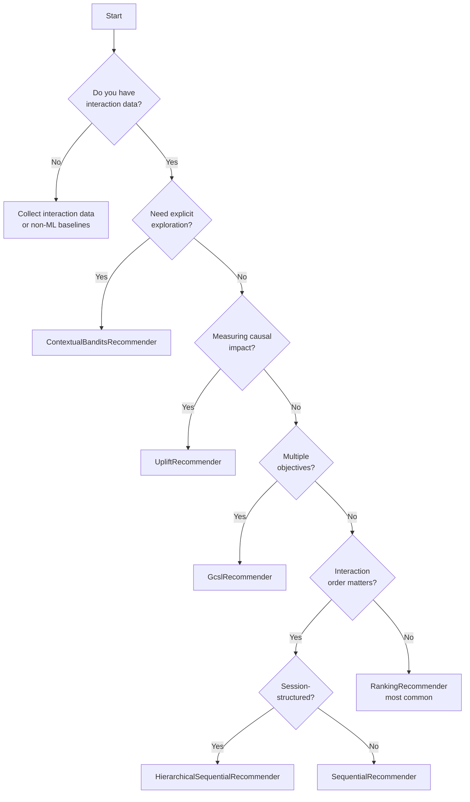

# Recommender Types Comparison

After choosing a [Scorer](../user-guide/scorers.md) and [Estimator](../user-guide/estimators.md), the next step is selecting a **Recommender type**. The library provides several recommender implementations, each suited for different use cases and decision-making scenarios.

## Quick Comparison

| Recommender | Use Case | Training Data | Exploration | Best For |
|------------|----------|---------------|-------------|----------|
| **[RankingRecommender](ranking.md)** | General ranking | User-item interactions | Via `sampling_temperature` | Most scenarios; also powers embedding models (TwoTower, NeuralFactorization, NCF) |
| **[SequentialRecommender](sequential.md)** | Sequential patterns | User-item interactions + TIMESTAMP | Via `sampling_temperature` | Watch/browse/purchase history (SASRec) |
| **[HierarchicalSequentialRecommender](hierarchical.md)** | Session-structured patterns | User-item interactions + TIMESTAMP | Via `sampling_temperature` | Session-aware history with cross-session memory (HRNN) |
| **[ContextualBanditsRecommender](bandits.md)** | Online learning | User-item interactions | Built-in strategies | Cold-start, A/B testing, exploration |
| **[UpliftRecommender](uplift.md)** | Causal impact | User-item + treatment | No | Incremental impact optimization (T/S/X-Learner) |
| **[GcslRecommender](gcsl.md)** | Multi-objective (GCSL) | User-item interactions | No | Multiple competing objectives |

## Decision Guide



## Recommender Overviews

### 1. RankingRecommender (Default)


**Purpose**: Standard ranking and recommendation tasks.

**Key Features**:
- Ranks items deterministically by predicted reward
- Supports probabilistic sampling for exploration
- Compatible with all scorer types — including embedding models
- Most commonly used recommender

**When to Use**:
- E-commerce product recommendations
- Content recommendation (articles, videos)
- Search result ranking
- Any standard ranking task
- Real-time retrieval with learned embeddings (pair with `ContextualizedTwoTowerEstimator`, `NeuralFactorizationEstimator`, or `NCFEstimator`)

[**→ Full Guide**](ranking.md)

---

### 2. SequentialRecommender

**Purpose**: Order-aware recommendations based on interaction sequences.

**Key Features**:
- Captures temporal patterns using the **SASRec** transformer model
- Sorts interactions by timestamp per user before training
- Supports both implicit (BCE) and explicit (MSE) feedback
- Compatible with `sampling_temperature` for probabilistic recommendations

**When to Use**:
- Video watch history or content queues
- E-commerce browsing and purchase journeys
- Music listening sessions
- Any scenario where "what did the user just do?" matters

[**→ Full Guide**](sequential.md)

---

### 3. HierarchicalSequentialRecommender

**Purpose**: Session-aware recommendations that model both within-session and cross-session dynamics.

**Key Features**:
- Two-level GRU hierarchy (**HRNN**): session GRU encodes items within a session; user GRU propagates state across sessions
- User GRU output seeds the next session's GRU — long-term preferences modulate short-term behaviour
- Sessions defined by a configurable `session_timeout_minutes` gap
- Supports both implicit (BCE) and explicit (MSE) feedback

**When to Use**:
- Users have natural session breaks (e-commerce visits, streaming sessions)
- Within-session context matters separately from long-term history
- You want to capture re-engagement patterns across sessions

[**→ Full Guide**](hierarchical.md)

---

### 4. ContextualBanditsRecommender

**Purpose**: Explicit exploration-exploitation trade-off for online learning.

**Key Features**:
- Built-in exploration strategies (Epsilon-Greedy, Static Action)
- Tracks which recommendations were exploratory
- Ideal for A/B testing scenarios
- Continuously learns from feedback

**When to Use**:
- Cold-start scenarios (new items/users)
- Online learning systems
- A/B testing and experimentation
- Need to balance exploration and exploitation

[**→ Full Guide**](bandits.md)

---

### 5. UpliftRecommender

**Purpose**: Estimate causal impact of recommendations.

**Key Features**:
- Measures incremental effect (uplift)
- T-Learner and S-Learner strategies
- Treatment effect estimation
- Focuses on causality, not correlation

**When to Use**:
- Maximize incremental revenue (not total revenue)
- Understand treatment effects
- Avoid recommending items users would engage with anyway
- Causal inference scenarios

[**→ Full Guide**](uplift.md)

---

### 6. GcslRecommender (GCSL)

**Purpose**: Goal-conditioned recommendations — one trained model, steerable at inference via swappable goal specifications.

**Key Features**:
- Keeps outcome columns as input features (the "goal conditioning" trick)
- Three built-in inference methods: `PredefinedValue`, `PercentileValue`, `MeanScalarization`
- Swap goals at inference with `set_inference_method()` — no retraining
- Out-of-distribution warnings when goals exceed training range
- Extensible: subclass `BaseInference` to add custom goal strategies

**When to Use**:
- Optimize for multiple competing metrics (engagement AND revenue AND diversity)
- A/B test different business objectives without retraining
- Steer between popular and niche recommendations
- Any scenario where one model should serve multiple objectives

[**→ Full Guide**](gcsl.md)

---

## Combining Recommenders

You can combine multiple recommenders for more sophisticated systems:

### Fallback Strategy
```python
# Try ML-based recommendation first, fall back to a simple baseline (e.g. popularity list)
try:
    recommendations = ml_recommender.recommend(...)
except InsufficientDataError:
    recommendations = popular_items_fallback(top_k)
```

### Multi-Stage Filtering
```python
# Stage 1: Your own business logic — build an allowed candidate id list
candidate_items = filter_items_by_business_rules(user_id, catalog_df)

# Stage 2: RankingRecommender scores only that subset
ranking_recommender.set_item_subset(candidate_items)
recommendations = ranking_recommender.recommend(
    interactions=interactions_df,
    users=users_df,
    top_k=top_k,
)
ranking_recommender.clear_item_subset()
```

## Unified Inference and Evaluation Interface

All recommenders share a consistent interface for making recommendations and evaluating performance:

### `recommend()` Method

Accepts `interactions` (optional) and `users` (optional) DataFrames:

- For most recommenders, these DataFrames provide user features and interaction context features
- When using a **`BaseEmbeddingEstimator`** subclass with **`UniversalScorer`** for real-time inference, the `users` DataFrame should contain `USER_ID` and `USER_EMBEDDING_NAME` (with pre-computed embeddings), and optionally other user features

```python
recommendations = recommender.recommend(
    interactions=interactions_df,
    users=users_df,
    top_k=5
)
```

**Learn more**: [Inference Guide](../user-guide/inference.md)

### `evaluate()` Method

Accepts a `RecommenderEvaluatorType` and `RecommenderMetricType`, which determine the evaluation technique and metric to use:

- **`score_items_kwargs`**: Passed to `score_items()`, can include `interactions` and `users` DataFrames (potentially with pre-computed embeddings for embedding models)
- **`eval_kwargs`**: Provides logged rewards and items for the evaluator

```python
result = recommender.evaluate(
    eval_type=RecommenderEvaluatorType.SIMPLE,
    metric_type=RecommenderMetricType.NDCG_AT_K,
    eval_top_k=5,
    score_items_kwargs={"interactions": interactions_df, "users": users_df},
    eval_kwargs={"logged_items": logged_items, "logged_rewards": logged_rewards}
)
```

**Learn more**: [Evaluation Guide](../user-guide/evaluation.md)

## Common Questions

### Q: Which recommender should I start with?

**A**: Start with **RankingRecommender**. It's the most flexible and works for 80% of use cases. Switch to specialized recommenders only when you have specific requirements (cold-start, causal inference, etc.).

### Q: Can I use multiple recommenders together?

**A**: Yes! See the "Combining Recommenders" section above for patterns.

### Q: Do all recommenders support evaluation?

**A**: Yes, all recommenders share the same `evaluate()` interface.

### Q: Which recommenders support real-time inference?

**A**: All recommenders support real-time inference, but performance varies:
- **Fastest**: `RankingRecommender` with tabular scorers and caching (see [Inference](../user-guide/inference.md))
- **Fast**: ContextualBanditsRecommender
- **Slower**: UpliftRecommender (more complex models)

### Q: Can I switch recommenders after training?

**A**: No, recommenders are trained independently. To switch, train the new recommender from scratch.

## Next Steps

Choose a recommender type to learn more:

- **[RankingRecommender](ranking.md)** - Start here for most use cases
- **[SequentialRecommender](sequential.md)** / **[HierarchicalSequentialRecommender](hierarchical.md)** - Order- and session-aware models
- **[ContextualBanditsRecommender](bandits.md)** - For exploration and A/B testing
- **[UpliftRecommender](uplift.md)** - For causal inference
- **[GcslRecommender](gcsl.md)** - Multi-objective ranking (GCSL)

Or continue learning:

- **[Training Guide](../user-guide/training.md)** - How to train recommenders
- **[Evaluation Guide](../user-guide/evaluation.md)** - How to evaluate recommenders
- **[Orchestration](../advanced/orchestration.md)** - Config-driven pipelines

