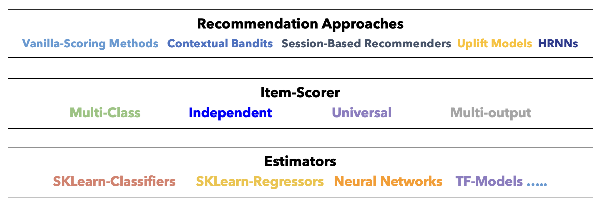

# Architecture Overview

The **recommender** library uses a clean 3-layer architecture that separates concerns and maximizes flexibility.

## The 3-Layer Design



### Layer 1: Recommender (Business Logic)

**Responsibility**: Implement recommendation strategy and business logic.

**Examples**:
- `RankingRecommender`: Rank items by predicted propensity
- `ContextualBanditsRecommender`: Exploration-exploitation strategies

**Key Methods**:
- `train()`: Train the underlying models
- `recommend()`: Generate top-k recommendations
- `score_items()`: Get scores for all items
- `evaluate()`: Evaluate recommendation quality

### Layer 2: Scorer (Item Scoring Strategy)

**Responsibility**: Determine how to score items given user context.

**Examples**:
- `UniversalScorer`: Single global model for all items (uses item features)
- `IndependentScorer`: Separate model per item
- `MulticlassScorer`: Treat items as competing classes
- `MultioutputScorer`: Multiple outcomes per prediction


**Key Method**:
- `score_items()`: Score all items for given user contexts

**Learn more**: [Scorer Selection Guide](scorers.md)

### Layer 3: Estimator (ML Model)

**Responsibility**: The actual machine learning model that makes predictions.

**Examples**:
- Classification: `XGBClassifierEstimator`, `LightGBMClassifierEstimator`, `LogisticRegressionClassifierEstimator`
- Regression: `XGBRegressorEstimator`, `LightGBMRegressorEstimator`, `SklearnUniversalRegressorEstimator`
- Deep Learning: `DeepFMClassifier`

**Key Methods**:
- `fit()`: Train the model
- `predict()` or `predict_proba()`: Make predictions

**Learn more**: [Estimator Guide](estimators.md)

## How the Layers Interact

```python
# Build the pipeline bottom-up
estimator = XGBClassifierEstimator({"learning_rate": 0.1})  # Layer 3
scorer = UniversalScorer(estimator)                          # Layer 2
recommender = RankingRecommender(scorer)                  # Layer 1

# Train flows down: Recommender → Scorer → Estimator
recommender.train(interactions_ds, users_ds, items_ds)
# 1. Recommender prepares datasets
# 2. Scorer organizes features
# 3. Estimator trains the model

# Inference flows up: Estimator → Scorer → Recommender
recommendations = recommender.recommend(interactions, users, top_k=5)
# 1. Recommender processes inputs
# 2. Scorer calls estimator for predictions
# 3. Estimator returns scores
# 4. Scorer formats scores
# 5. Recommender ranks and returns top-k
```

## Benefits of This Architecture

### 1. Modularity
Mix and match components to create custom pipelines:

```python
# Scenario 1: XGBoost with Universal Scorer
estimator1 = XGBClassifierEstimator({...})
scorer1 = UniversalScorer(estimator1)
recommender1 = RankingRecommender(scorer1)

# Scenario 2: LightGBM with Independent Scorer
estimator2 = LightGBMClassifierEstimator({...})
scorer2 = IndependentScorer(estimator2)
recommender2 = RankingRecommender(scorer2)

# Scenario 3: DeepFM with Universal Scorer
estimator3 = DeepFMClassifier({...})
scorer3 = UniversalScorer(estimator3)
recommender3 = RankingRecommender(scorer3)
```

### 2. Extensibility
Add new components without changing existing code:

```python
# Add a custom estimator
class MyCustomEstimator(BaseEstimator):
    def fit(self, X, y):
        # Your training logic
        pass
    
    def predict_proba(self, X):
        # Your inference logic
        pass

# Use with existing scorers and recommenders
estimator = MyCustomEstimator()
scorer = UniversalScorer(estimator)
recommender = RankingRecommender(scorer)
```

### 3. Testability
Test components independently:

```python
# Test estimator alone
estimator.fit(X_train, y_train)
predictions = estimator.predict(X_test)

# Test scorer alone
scores = scorer.score_items(interactions, users)

# Test recommender end-to-end
recommendations = recommender.recommend(interactions, users, top_k=5)
```

### 4. Reusability
Share components across different recommenders:

```python
# Same scorer for different recommender types
scorer = UniversalScorer(estimator)

propensity_rec = RankingRecommender(scorer)
bandit_rec = ContextualBanditsRecommender(scorer, strategy_type=...)
```

## Data Flow

### Training Flow

```
Datasets (InteractionsDataset, UsersDataset, ItemsDataset)
    ↓
Recommender.train()
    ↓ (prepares features, applies schemas)
Scorer (organizes data by scoring strategy)
    ↓
Estimator.fit(X, y)
    ↓
Trained Model
```

### Inference Flow

```
Raw Input (interactions_df, users_df)
    ↓
Recommender.recommend()
    ↓
[Optional] Retriever.retrieve()        ← if retriever attached; skipped otherwise
    ↓ candidate item subset
Scorer.score_items()                   ← scores full catalog, or only the candidate subset
    ↓
Estimator.predict_proba()
    ↓
Scores (one per item in scope)
    ↓
Recommender (ranks by score, applies sampling, returns top-k)
    ↓
Recommendations (numpy array)
```

## Two-Stage Retrieval (Optional, Built-In)

`RankingRecommender` ships with a **built-in retrieval pre-stage** — enabled by a single
constructor argument, skipped entirely when omitted. The 3-layer core is unchanged in both
modes; retrieval just narrows what the ranker scores. The built-in retrievers use simple
brute-force approaches (dot-product search, cosine similarity, interaction counts) that
work well at moderate catalog sizes. For larger catalogs, the interface is designed to be
extended with any ANN backend in about 30 lines.

```
# Default (no retriever): full-catalog ranking
[RankingRecommender → Scorer → Estimator]
        scores all N items → ranks → top-k

# With retriever: two-stage
[EmbeddingRetriever / ContentBasedRetriever / PopularityRetriever]
        ↓ top-200 candidates
[RankingRecommender → Scorer → Estimator]
        scores 200 items → ranks → top-k
```

```python
from skrec.retriever import EmbeddingRetriever

# Two-stage: add one argument
recommender = RankingRecommender(
    scorer=UniversalScorer(estimator=MatrixFactorizationEstimator()),
    retriever=EmbeddingRetriever(top_k=200),
)

# Single-stage: omit it entirely — same interface, same semantics
recommender = RankingRecommender(
    scorer=UniversalScorer(estimator=MatrixFactorizationEstimator()),
)
```

Because retrieval is built into the library (not a separate service), you get the full
two-stage pipeline with no infrastructure changes. You can start without a retriever on a
small catalog and add one later with a single line change.

**Learn more**: [Two-Stage Retrieval Guide](retrieval.md)

## Business rules and hard constraints

Deterministic constraints (compliance, inventory, age gates) are not a separate recommender
type in this library. Apply them **outside** the ranker (upstream filtering) or by passing
an allowed candidate set via **`item_subset`** / a **retriever** on `RankingRecommender`, then
keep the usual **Scorer → Estimator** stack for scoring and ranking within that set.

## Design Principles

### 1. Separation of Concerns
- **Recommender**: Business logic and strategy
- **Scorer**: Item scoring approach
- **Estimator**: ML model implementation

### 2. Dependency Inversion
- High-level modules (Recommender) don't depend on low-level modules (Estimator)
- Both depend on abstractions (BaseScorer, BaseEstimator)

### 3. Open/Closed Principle
- Open for extension (add new components)
- Closed for modification (existing code doesn't change)

### 4. Single Responsibility
- Each component has one reason to change
- Estimator changes don't affect Recommender logic

## Common Patterns

### Pattern 1: Swap Estimators
```python
# Start with XGBoost
scorer_xgb = UniversalScorer(XGBClassifierEstimator({...}))
recommender = RankingRecommender(scorer_xgb)

# Later switch to LightGBM (same scorer and recommender interface)
scorer_lgbm = UniversalScorer(LightGBMClassifierEstimator({...}))
recommender = RankingRecommender(scorer_lgbm)
```

### Pattern 2: Scorer Comparison
```python
# Compare different scoring strategies
scorers = [
    UniversalScorer(estimator),      # Global model
    IndependentScorer(estimator),    # Per-item models
    MulticlassScorer(estimator)      # Multiclass approach
]

for scorer in scorers:
    rec = RankingRecommender(scorer)
    rec.train(...)
    ndcg = rec.evaluate(...)
    print(f"{scorer.__class__.__name__}: NDCG = {ndcg}")
```

### Pattern 3: Ensemble
```python
# Combine multiple recommenders
rec1 = RankingRecommender(scorer1)
rec2 = RankingRecommender(scorer2)

scores1 = rec1.score_items(...)
scores2 = rec2.score_items(...)

# Ensemble scores
ensemble_scores = 0.7 * scores1 + 0.3 * scores2
```

## Capability matrix

For a concise **compatibility table** (training planes, scorers, `recommend` vs `recommend_online`, retrievers, batch training), see the **[Capability matrix](capability-matrix.md)**.

## Next Steps

- **[Scorer Selection Guide](scorers.md)** - Choose the right scorer
- **[Estimator Guide](estimators.md)** - Choose the right estimator
- **[Two-Stage Retrieval](retrieval.md)** - Scale to large catalogs
- **[Recommender Types](../recommender-types/comparison.md)** - Choose the right recommender
- **[Training Guide](training.md)** - Train your pipeline

