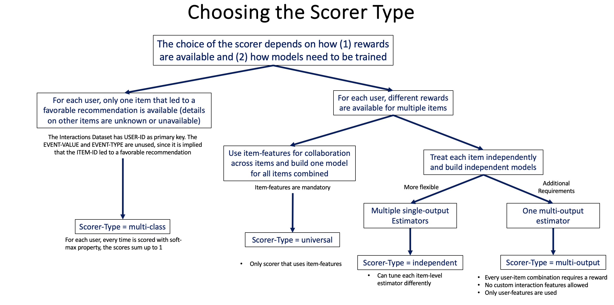
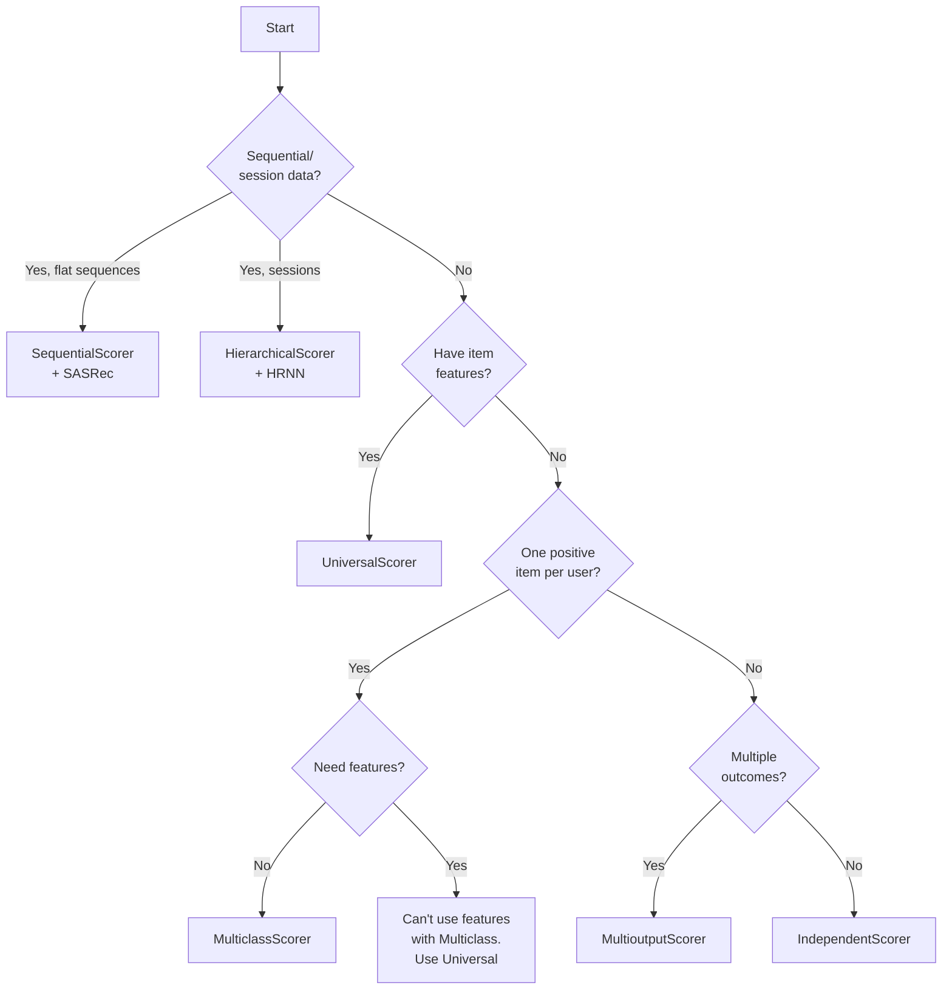

# Scorer Selection Guide

Scorers determine **how items are scored** given user context. Choosing the right scorer depends on your data structure and modeling needs.



## Quick Comparison

| Scorer | Models | Item Features | Use Case |
|--------|--------|---------------|----------|
| **Universal** | 1 global model | ✅ Required | Best performance, needs item features. Also supports embedding estimators. |
| **Independent** | 1 model per item | ❌ Not used | Simple, no item features needed |
| **Multiclass** | 1 model | ❌ Not allowed | One positive item per user |
| **Multioutput** | 1 model | ❌ Not allowed | Multiple outcomes per user |
| **Sequential** | 1 sequential model | ❌ N/A | SASRec — scores from interaction sequences |
| **Hierarchical** | 1 sequential model | ❌ N/A | HRNN — scores from session-structured sequences |

## 1. UniversalScorer (Most Common)

**How it works**: Builds a single global model that learns patterns across all items using item features.

```python
from skrec.scorer.universal import UniversalScorer

scorer = UniversalScorer(estimator)
```

**Dataset Requirements**:
- ✅ **Interactions**: Multiple rows per user allowed
- ✅ **Users**: Required
- ✅ **Items**: **Required** (item features are used)
- 📊 **Outcome**: Binary (classification) or continuous (regression)

**Pros**:
- Best performance (learns item similarities)
- Handles new items if they have features
- Efficient inference

**Cons**:
- Requires item features
- More complex setup

**When to use**: This is the **default choice** for most scenarios. Use when you have item metadata.

---

## 2. IndependentScorer

**How it works**: Builds separate models for each item. No sharing across items.

```python
from skrec.scorer.independent import IndependentScorer

scorer = IndependentScorer(estimator)
```

**Dataset Requirements**:
- ✅ **Interactions**: Multiple rows per user allowed
- ⚠️ **Users**: Optional
- ❌ **Items**: Not used (no item features needed)
- 📊 **Outcome**: Binary or continuous

**Pros**:
- Simple (no item features needed)
- Supports parallel inference: `scorer.set_parallel_inference(parallel_inference_status=True, num_cores=4)`
- Each item can have very different patterns

**Cons**:
- No knowledge sharing across items
- Cannot handle new items
- Requires sufficient data per item

**When to use**: When you don't have item features, or each item needs a specialized model.

---

## 3. MulticlassScorer

**How it works**: Treats items as competing classes in a multiclass classification problem.

```python
from skrec.scorer.multiclass import MulticlassScorer

scorer = MulticlassScorer(estimator)
```

**Dataset Requirements**:
- ⚠️ **Interactions**: **One row per user only** (one positive item per user)
- ❌ **Users**: Not allowed
- ❌ **Items**: Not allowed
- 📊 **Outcome**: Not allowed (uses `ITEM_ID` as target)

**Pros**:
- Simple data structure
- Fast training and inference
- Works well when users have clear single preferences

**Cons**:
- Restrictive data format (one row per user)
- No user or item features
- Limited flexibility

**When to use**: Simple scenarios with one positive item per user and no additional features.

---

## 4. MultioutputScorer

**How it works**: Predicts multiple outcomes simultaneously (one for each item or outcome type).

```python
from skrec.scorer.multioutput import MultioutputScorer

scorer = MultioutputScorer(estimator)
```

**Dataset Requirements**:
- ⚠️ **Interactions**: **One row per user only**
- ❌ **Users**: Not allowed
- ❌ **Items**: Not allowed
- 📊 **Outcome**: Multiple columns with prefix `OUTCOME_*` (e.g., `OUTCOME_item1`, `OUTCOME_click`)

**Example Data**:
```python
interactions_df = pd.DataFrame({
    "USER_ID": ["user_1", "user_2"],
    "OUTCOME_item_A": [1, 0],  # Did user engage with item_A?
    "OUTCOME_item_B": [0, 1],  # Did user engage with item_B?
    "OUTCOME_item_C": [1, 0]   # Did user engage with item_C?
})
```

**Pros**:
- Handles multiple outcomes per user
- Efficient (one model for all outcomes)

**Cons**:
- Restrictive data format
- No user or item features
- All items must be known at training time

**When to use**: When you have a fixed set of items and users interact with multiple items simultaneously.

---

## 5. SequentialScorer

**How it works**: Wraps a `SequentialEstimator` (SASRec) that scores all items from a user's interaction sequence in a single forward pass.

```python
from skrec.scorer.sequential import SequentialScorer

scorer = SequentialScorer(estimator)  # estimator must be a SequentialEstimator
```

**Dataset Requirements**:
- ✅ **Interactions**: Multiple rows per user with `TIMESTAMP` column
- ❌ **Users**: Not used (sequences encode user preferences)
- ✅ **Items**: Used for item vocabulary
- 📊 **Outcome**: Binary

**When to use**: When interaction order matters and you want to model sequential patterns (e.g., "users who watched A then B tend to watch C next"). Requires `SequentialRecommender` and a SASRec estimator. See [SASRec guide](sasrec.md).

---

## 6. HierarchicalScorer

**How it works**: Wraps a `SequentialEstimator` (HRNN) that models session-structured interaction histories with a two-level GRU hierarchy.

```python
from skrec.scorer.hierarchical import HierarchicalScorer

scorer = HierarchicalScorer(estimator)  # estimator must be a SequentialEstimator
```

**Dataset Requirements**:
- ✅ **Interactions**: Multiple rows per user with `TIMESTAMP` (and optionally `SESSION_ID`)
- ❌ **Users**: Not used
- ✅ **Items**: Used for item vocabulary
- 📊 **Outcome**: Binary

**When to use**: When users have distinct browsing sessions and cross-session context matters. Requires `HierarchicalSequentialRecommender` and an HRNN estimator. See [HRNN guide](hrnn.md).

---

## Decision Guide



## Estimator Compatibility

### Binary Classification Estimators
Compatible with scorers when outcomes are binary (0/1):
- UniversalScorer ✅
- IndependentScorer ✅
- MulticlassScorer ✅
- MultioutputScorer ✅

### Regression Estimators
Compatible with scorers when outcomes are continuous:
- UniversalScorer ✅
- IndependentScorer ✅
- MulticlassScorer ❌
- MultioutputScorer ✅

### Multiclass Classification Estimators
- MulticlassScorer ✅
- Others ❌

### Embedding Estimators (MF, NCF, TwoTower, DCN, NeuralFactorization)
- UniversalScorer ✅ (auto-dispatches to embedding pipeline)
- IndependentScorer ❌
- MulticlassScorer ❌
- MultioutputScorer ❌

### Sequential Estimators (SASRec, HRNN)
- SequentialScorer ✅ (for SASRec)
- HierarchicalScorer ✅ (for HRNN)
- All other scorers ❌

## Complete Examples

### Example 1: Universal Scorer (E-commerce)
```python
from skrec.scorer.universal import UniversalScorer
from skrec.estimator.classification.xgb_classifier import XGBClassifierEstimator

# Have item features (price, category, brand)
estimator = XGBClassifierEstimator({"learning_rate": 0.1})
scorer = UniversalScorer(estimator)
```

### Example 2: Independent Scorer (Content Recommendation)
```python
from skrec.scorer.independent import IndependentScorer
from skrec.estimator.classification.lightgbm_classifier import LightGBMClassifierEstimator

# No item features, each content piece is unique
estimator = LightGBMClassifierEstimator({"learning_rate": 0.05})
scorer = IndependentScorer(estimator)

# Enable parallel inference for speed
scorer.set_parallel_inference(parallel_inference_status=True, num_cores=4)
```

### Example 3: Multiclass Scorer (Simple Ranking)
```python
from skrec.scorer.multiclass import MulticlassScorer
from skrec.estimator.classification.xgb_classifier import XGBClassifierEstimator

# Simple setup: one item per user, no features
estimator = XGBClassifierEstimator({"objective": "multi:softmax"})
scorer = MulticlassScorer(estimator)
```

### Example 4: Multioutput Scorer (Multi-label)
```python
from xgboost import XGBClassifier
from skrec.scorer.multioutput import MultioutputScorer
from skrec.estimator.classification.multioutput_classifier import MultiOutputClassifierEstimator

# Multiple items per user, fixed item set
estimator = MultiOutputClassifierEstimator(XGBClassifier, params={})
scorer = MultioutputScorer(estimator)
```

## Best Practices

### 1. Start with UniversalScorer
- Best performance in most scenarios
- Leverages item features for better predictions
- Only switch if you have constraints

### 2. Feature Engineering
- UniversalScorer benefits greatly from good item features
- IndependentScorer relies entirely on user-context features

### 3. Data Volume
- UniversalScorer: Needs sufficient data across items
- IndependentScorer: Needs sufficient data **per item**
- MulticlassScorer: Needs balanced classes
- MultioutputScorer: Needs data for all outcome columns

### 4. Performance Optimization
- UniversalScorer: Fast inference (one model call); supports `score_fast()` for single-user real-time serving
- IndependentScorer: Use `set_parallel_inference()` for speed; supports `score_fast()`
- MulticlassScorer: Fastest (single prediction); supports `score_fast()`
- MultioutputScorer: Moderate (one prediction, multiple outputs); supports `score_fast()`

All non-embedding scorers support `scorer.score_fast(features_df)` for low-latency
single-user inference. For end-to-end real-time serving (schema validation + ranking),
use `recommender.recommend_online()` instead.

## Common Issues

### Issue: "Items dataset required for Universal scorer"

**Solution**: Universal scorer needs item features. Provide `items_ds` or switch to Independent scorer.

### Issue: "Expected one row per user"

**Solution**: Multiclass and Multioutput scorers require one row per user. Aggregate your data or use Universal/Independent scorer.

### Issue: Independent scorer is slow

**Solution**: Enable parallel inference:
```python
scorer.set_parallel_inference(parallel_inference_status=True, num_cores=4)
```

## Next Steps

- **[Estimator Guide](estimators.md)** - Choose the right estimator for your scorer
- **[Architecture Overview](architecture.md)** - Understand how scorers fit in the system
- **[Training Guide](training.md)** - Train your scorer

