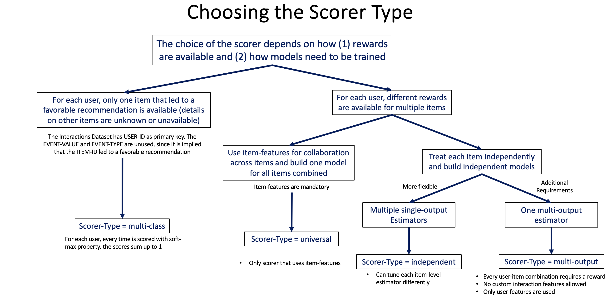
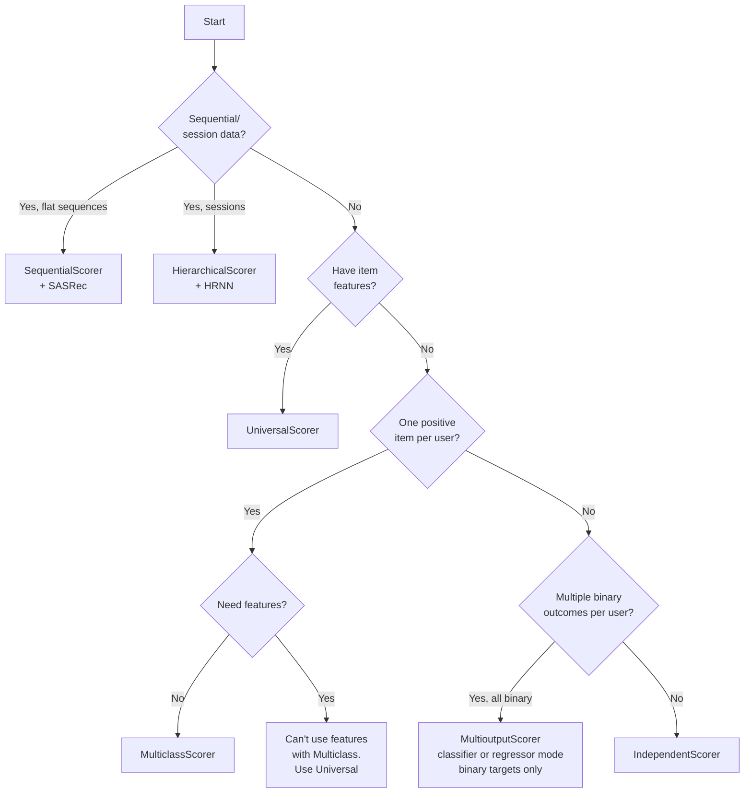

# Scorer Selection Guide

Scorers determine **how items are scored** given user context. Choosing the right scorer depends on your data structure and modeling needs.



## Quick Comparison

| Scorer | Models | Item Features | Use Case |
|--------|--------|---------------|----------|
| **Universal** | 1 global model | ✅ Required | Best performance, needs item features. Also supports embedding estimators. |
| **Independent** | 1 model per item | ❌ Not used | Simple, no item features needed |
| **Multiclass** | 1 model | ❌ Not allowed | One positive item per user |
| **Multioutput** | 1 model | ❌ Not allowed | Multiple outcomes per user |
| **Sequential** | 1 sequential model | ❌ N/A | SASRec — scores from interaction sequences |
| **Hierarchical** | 1 sequential model | ❌ N/A | HRNN — scores from session-structured sequences |

## 1. UniversalScorer (Most Common)

**How it works**: Builds a single global model that learns patterns across all items using item features.

```python
from skrec.scorer.universal import UniversalScorer

scorer = UniversalScorer(estimator)
```

**Dataset Requirements**:
- ✅ **Interactions**: Multiple rows per user allowed
- ✅ **Users**: Required
- ✅ **Items**: **Required** (item features are used)
- 📊 **Outcome**: Binary (classification) or continuous (regression)

**Pros**:
- Best performance (learns item similarities)
- Handles new items if they have features
- Efficient inference

**Cons**:
- Requires item features
- More complex setup

**When to use**: This is the **default choice** for most scenarios. Use when you have item metadata.

---

## 2. IndependentScorer

**How it works**: Builds separate models for each item. No sharing across items.

```python
from skrec.scorer.independent import IndependentScorer

scorer = IndependentScorer(estimator)
```

**Dataset Requirements**:
- ✅ **Interactions**: Multiple rows per user allowed
- ⚠️ **Users**: Optional
- ❌ **Items**: Not used (no item features needed)
- 📊 **Outcome**: Binary or continuous

**Pros**:
- Simple (no item features needed)
- Supports parallel inference: `scorer.set_parallel_inference(parallel_inference_status=True, num_cores=4)`
- Each item can have very different patterns

**Cons**:
- No knowledge sharing across items
- Cannot handle new items
- Requires sufficient data per item

**When to use**: When you don't have item features, or each item needs a specialized model.

---

## 3. MulticlassScorer

**How it works**: Treats items as competing classes in a multiclass classification problem.

```python
from skrec.scorer.multiclass import MulticlassScorer

scorer = MulticlassScorer(estimator)
```

**Dataset Requirements**:
- ⚠️ **Interactions**: **One row per user only** (one positive item per user)
- ❌ **Users**: Not allowed
- ❌ **Items**: Not allowed
- 📊 **Outcome**: Not allowed (uses `ITEM_ID` as target)

**Pros**:
- Simple data structure
- Fast training and inference
- Works well when users have clear single preferences

**Cons**:
- Restrictive data format (one row per user)
- No user or item features
- Limited flexibility

**When to use**: Simple scenarios with one positive item per user and no additional features.

---

## 4. MultioutputScorer

**How it works**: Wide-format multi-target scorer — one ``ITEM_<name>`` column per target, all trained jointly. Operates in one of two modes depending on the estimator type:

- **Classifier mode** (with a `BaseClassifier`, e.g. `MultiOutputClassifierEstimator`): every target must be **binary numeric** — values strictly in `{0, 1}` (or `{0.0, 1.0}`). Pre-encode non-numeric binary labels at the caller (e.g. `df[col] = (df[col] == "yes").astype(float)`). Returns per-class probabilities (uniform column names `ITEM_<name>_0` / `ITEM_<name>_1`), supports cross-target ranking metrics, per-label classification metrics, and `recommend(top_k)` returning the top-K most-likely-positive labels per user.
- **Regressor mode** (with a `BaseRegressor`, e.g. `MultiOutputRegressorEstimator`): every target is continuous. Returns predicted values per target, supports per-target regression metrics (RMSE, MAE).

**Multi-class targets (3+ classes per `ITEM_<name>`) are rejected at fit time.** See [Migration paths for multi-class targets](#migration-paths-for-multi-class-targets) below.

```python
# Classifier mode — multi-label binary classification
from xgboost import XGBClassifier
from skrec.scorer.multioutput import MultioutputScorer
from skrec.estimator.classification.multioutput_classifier import (
    MultiOutputClassifierEstimator,
)

estimator = MultiOutputClassifierEstimator(
    base_estimator=XGBClassifier,
    params={"n_estimators": 50, "max_depth": 4, "objective": "binary:logistic"},
)
scorer = MultioutputScorer(estimator)
```

```python
# Regressor mode — multi-target regression
from xgboost import XGBRegressor
from skrec.scorer.multioutput import MultioutputScorer
from skrec.estimator.regression.multioutput_regressor import (
    MultiOutputRegressorEstimator,
)

estimator = MultiOutputRegressorEstimator(
    base_estimator=XGBRegressor,
    params={"n_estimators": 50, "max_depth": 4, "objective": "reg:squarederror"},
)
scorer = MultioutputScorer(estimator)
```

**Dataset Requirements**:
- ⚠️ **Interactions**: **One row per user only**
- ❌ **Users**: Not allowed (pass user features as plain columns inside interactions)
- ❌ **Items**: Not allowed
- 📊 **Targets**: Multiple `ITEM_<name>` columns; binary in classifier mode, continuous in regressor mode

**Example Data (classifier mode)**:
```python
interactions_df = pd.DataFrame({
    "USER_ID": ["user_1", "user_2"],
    "age": [28, 41],                      # User feature, in-frame
    "ITEM_label_workflow_automation": [1, 0],
    "ITEM_label_dashboard":            [0, 1],
    "ITEM_label_custom_roles":         [1, 0],
})
```

**Example Data (regressor mode)**:
```python
interactions_df = pd.DataFrame({
    "USER_ID": ["user_1", "user_2"],
    "age": [28, 41],
    "ITEM_revenue":         [125.50, 89.20],
    "ITEM_minutes_engaged": [42.0,    18.5],
    "ITEM_clicks":          [12,      5],
})
```

### Public introspection surface

Programmatic callers can inspect the scorer's mode and per-target metadata:

| Attribute / method | Type | Meaning |
|---|---|---|
| `scorer.is_classifier` | `bool` | `True` for binary classifier mode (estimator is a `BaseClassifier`); `False` for regressor mode (`BaseRegressor`). Set at construction; immutable afterwards. |
| `scorer.item_names` | `list[str]` / `np.ndarray[str]` | Every `ITEM_<name>` target seen at fit, in input order. Used to align `logged_rewards` columns with the trained catalogue. |
| `scorer.degenerate_targets` | `Dict[str, float]` | Manifest of targets that fell back to a constant predictor under `DegenerateTargetPolicy.CONSTANT` — empty when `RAISE` is in effect (training would have aborted) or when no targets were degenerate. Maps target name → the only observed value (always `0.0` or `1.0` since the binary-only contract pins targets to `{0, 1}`). |
| `scorer.score_items_per_target(interactions=df)` | `pd.DataFrame` of shape `(n_users, n_targets)` | Per-target relevance scores: positive-class probability per target in classifier mode, predicted value per target in regressor mode. Used internally by `recommend()` and `evaluate()` for ranking metrics; available as a public method for callers that want the per-target view directly. |
| `scorer.positive_proba_column_name(label)` | `str` | The column name in `score_items` output carrying `P(label = 1)`. Always returns `f"{label}_1"` since the binary-only contract pins the positive class to `1`. Classifier mode only. |

### Degenerate-target handling (`on_degenerate_target`)

A "degenerate" target is one whose training slice has only one unique value (no learning signal). The scorer's behaviour is configurable via the `DegenerateTargetPolicy` enum:

```python
from skrec.scorer.multioutput import MultioutputScorer, DegenerateTargetPolicy

# Default: fail loudly at train() with the offending column names.
scorer = MultioutputScorer(estimator)  # on_degenerate_target=DegenerateTargetPolicy.RAISE

# Opt-in: fit a constant predictor for degenerate columns; train the rest normally.
scorer = MultioutputScorer(
    estimator,
    on_degenerate_target=DegenerateTargetPolicy.CONSTANT,
)
```

Under `CONSTANT`, `recommender.scorer.degenerate_targets` exposes the manifest of columns that fell back to constant prediction. Per-label classification metrics on degenerate targets emit `nan` (excluded from macro-mean), and ranking metrics drop them entirely (constant predictions would tie at the top of every per-user ranking and bias the metric).

**`recommend(top_k)` also drops degenerate targets** before ranking. A `WARNING` is logged once per recommender instance listing the excluded targets. If `top_k` exceeds the count of non-degenerate targets, the request is silently capped at the available count with a warning — callers that pre-allocate by `top_k` should account for this. If every target is degenerate (only reachable when an `item_subset` selects only degenerate columns), `recommend()` raises with a pointer at `scorer.predict_classes()` for the constant per-target labels.

### Migration paths for multi-class targets

Targets with 3+ classes are rejected at fit time. Choose one:

1. **Single multi-class target** → use [`MulticlassScorer`](#3-multiclassscorer) in long format.
2. **Multiple multi-class targets** → one-hot encode each into binary columns (e.g. `ITEM_X` with classes `{A, B, C}` becomes `ITEM_X_A`, `ITEM_X_B`, `ITEM_X_C`, each binary).
3. **Heterogeneous target types (mix of binary, regression, multi-class)** → wait for the planned mixed-type multi-target scorer.

**Pros**:
- Multi-label binary classification with cross-target ranking semantics
- Multi-target regression with per-target diagnostics
- One model for all targets (joint training, shared user features in-frame)

**Cons**:
- Restrictive data format (one row per user; no separate users/items DataFrame)
- Binary-only enforcement in classifier mode (multi-class targets must be reshaped)
- All targets must be known at training time

**When to use**: A fixed set of binary outcomes per user (feature adoption, action labels) where you want both per-target diagnostics AND cross-target ranking ("top features this user is most likely to adopt"). For continuous outcomes, the regressor mode covers per-target prediction.

---

## 5. SequentialScorer

**How it works**: Wraps a `SequentialEstimator` (SASRec) that scores all items from a user's interaction sequence in a single forward pass.

```python
from skrec.scorer.sequential import SequentialScorer

scorer = SequentialScorer(estimator)  # estimator must be a SequentialEstimator
```

**Dataset Requirements**:
- ✅ **Interactions**: Multiple rows per user with `TIMESTAMP` column
- ❌ **Users**: Not used (sequences encode user preferences)
- ✅ **Items**: Used for item vocabulary
- 📊 **Outcome**: Binary

**When to use**: When interaction order matters and you want to model sequential patterns (e.g., "users who watched A then B tend to watch C next"). Requires `SequentialRecommender` and a SASRec estimator. See [SASRec guide](sasrec.md).

---

## 6. HierarchicalScorer

**How it works**: Wraps a `SequentialEstimator` (HRNN) that models session-structured interaction histories with a two-level GRU hierarchy.

```python
from skrec.scorer.hierarchical import HierarchicalScorer

scorer = HierarchicalScorer(estimator)  # estimator must be a SequentialEstimator
```

**Dataset Requirements**:
- ✅ **Interactions**: Multiple rows per user with `TIMESTAMP` (and optionally `SESSION_ID`)
- ❌ **Users**: Not used
- ✅ **Items**: Used for item vocabulary
- 📊 **Outcome**: Binary

**When to use**: When users have distinct browsing sessions and cross-session context matters. Requires `HierarchicalSequentialRecommender` and an HRNN estimator. See [HRNN guide](hrnn.md).

---

## Decision Guide


```mermaid
graph TD
    A[Start] --> Z{Sequential/<br/>session data?}
    Z -->|Yes, flat sequences| SEQ[SequentialScorer<br/>+ SASRec]
    Z -->|Yes, sessions| HIER[HierarchicalScorer<br/>+ HRNN]
    Z -->|No| B{Have item<br/>features?}
    B -->|Yes| C[UniversalScorer]
    B -->|No| D{One positive<br/>item per user?}
    D -->|Yes| E{Need features?}
    E -->|No| F[MulticlassScorer]
    E -->|Yes| G[Can't use features<br/>with Multiclass.<br/>Use Universal]
    D -->|No| H{Multiple binary<br/>outcomes per user?}
    H -->|Yes, all binary| I[MultioutputScorer<br/>classifier or regressor mode<br/>binary targets only]
    H -->|No| J[IndependentScorer]
```

## Estimator Compatibility

### Binary Classification Estimators
Compatible with scorers when outcomes are binary (0/1):
- UniversalScorer ✅
- IndependentScorer ✅
- MulticlassScorer ✅
- MultioutputScorer ✅

### Regression Estimators
Compatible with scorers when outcomes are continuous:
- UniversalScorer ✅
- IndependentScorer ✅
- MulticlassScorer ❌
- MultioutputScorer ✅ (regressor mode — pair with `MultiOutputRegressorEstimator` for multi-target regression)

### Multiclass Classification Estimators
- MulticlassScorer ✅
- Others ❌

### Embedding Estimators (MF, NCF, TwoTower, DCN, NeuralFactorization)
- UniversalScorer ✅ (auto-dispatches to embedding pipeline)
- IndependentScorer ❌
- MulticlassScorer ❌
- MultioutputScorer ❌

### Sequential Estimators (SASRec, HRNN)
- SequentialScorer ✅ (for SASRec)
- HierarchicalScorer ✅ (for HRNN)
- All other scorers ❌

## Complete Examples

### Example 1: Universal Scorer (E-commerce)
```python
from skrec.scorer.universal import UniversalScorer
from skrec.estimator.classification.xgb_classifier import XGBClassifierEstimator

# Have item features (price, category, brand)
estimator = XGBClassifierEstimator({"learning_rate": 0.1})
scorer = UniversalScorer(estimator)
```

### Example 2: Independent Scorer (Content Recommendation)
```python
from skrec.scorer.independent import IndependentScorer
from skrec.estimator.classification.lightgbm_classifier import LightGBMClassifierEstimator

# No item features, each content piece is unique
estimator = LightGBMClassifierEstimator({"learning_rate": 0.05})
scorer = IndependentScorer(estimator)

# Enable parallel inference for speed
scorer.set_parallel_inference(parallel_inference_status=True, num_cores=4)
```

### Example 3: Multiclass Scorer (Simple Ranking)
```python
from skrec.scorer.multiclass import MulticlassScorer
from skrec.estimator.classification.xgb_classifier import XGBClassifierEstimator

# Simple setup: one item per user, no features
estimator = XGBClassifierEstimator({"objective": "multi:softmax"})
scorer = MulticlassScorer(estimator)
```

### Example 4a: Multioutput Scorer (Multi-label binary classification)
```python
from xgboost import XGBClassifier
from skrec.scorer.multioutput import MultioutputScorer
from skrec.estimator.classification.multioutput_classifier import MultiOutputClassifierEstimator

# Multi-label classification: predict adoption probability for each binary target
estimator = MultiOutputClassifierEstimator(XGBClassifier, params={})
scorer = MultioutputScorer(estimator)
```

### Example 4b: Multioutput Scorer (Multi-target regression)
```python
from xgboost import XGBRegressor
from skrec.scorer.multioutput import MultioutputScorer
from skrec.estimator.regression.multioutput_regressor import MultiOutputRegressorEstimator

# Multi-target regression: predict continuous values per target (e.g. revenue, clicks, minutes)
estimator = MultiOutputRegressorEstimator(XGBRegressor, params={})
scorer = MultioutputScorer(estimator)
```

## Best Practices

### 1. Start with UniversalScorer
- Best performance in most scenarios
- Leverages item features for better predictions
- Only switch if you have constraints

### 2. Feature Engineering
- UniversalScorer benefits greatly from good item features
- IndependentScorer relies entirely on user-context features

### 3. Data Volume
- UniversalScorer: Needs sufficient data across items
- IndependentScorer: Needs sufficient data **per item**
- MulticlassScorer: Needs balanced classes
- MultioutputScorer: Needs data for all `ITEM_<name>` columns; binary-only in classifier mode (multi-class targets rejected at fit time — see [Migration paths for multi-class targets](#migration-paths-for-multi-class-targets)). Single-class-in-train degenerate targets handled per the `on_degenerate_target` policy (`RAISE` default; `CONSTANT` to fall back to a constant predictor)

### 4. Performance Optimization
- UniversalScorer: Fast inference (one model call); supports `score_fast()` for single-user real-time serving
- IndependentScorer: Use `set_parallel_inference()` for speed; supports `score_fast()`
- MulticlassScorer: Fastest (single prediction); supports `score_fast()`
- MultioutputScorer: Moderate (one prediction, multiple outputs); supports `score_fast()`

All non-embedding scorers support `scorer.score_fast(features_df)` for low-latency
single-user inference. For end-to-end real-time serving (schema validation + ranking),
use `recommender.recommend_online()` instead.

## Common Issues

### Issue: "Items dataset required for Universal scorer"

**Solution**: Universal scorer needs item features. Provide `items_ds` or switch to Independent scorer.

### Issue: "Expected one row per user"

**Solution**: Multiclass and Multioutput scorers require one row per user. Aggregate your data or use Universal/Independent scorer.

### Issue: Independent scorer is slow

**Solution**: Enable parallel inference:
```python
scorer.set_parallel_inference(parallel_inference_status=True, num_cores=4)
```

## Next Steps

- **[Estimator Guide](estimators.md)** - Choose the right estimator for your scorer
- **[Architecture Overview](architecture.md)** - Understand how scorers fit in the system
- **[Training Guide](training.md)** - Train your scorer

